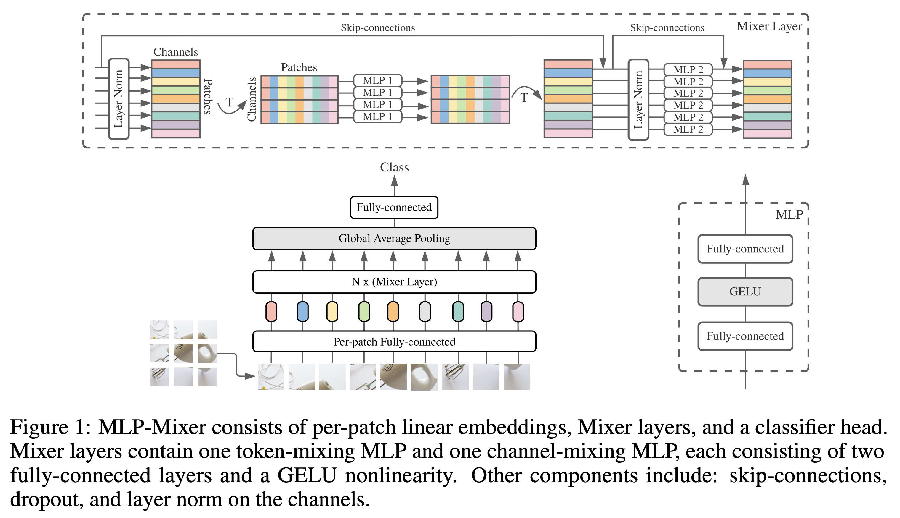
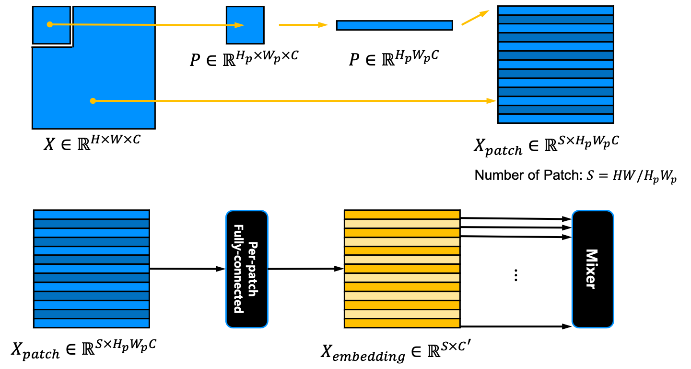
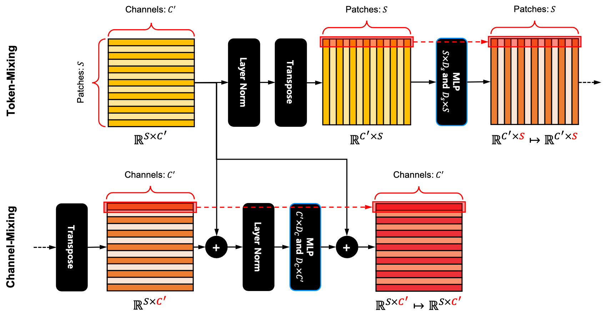
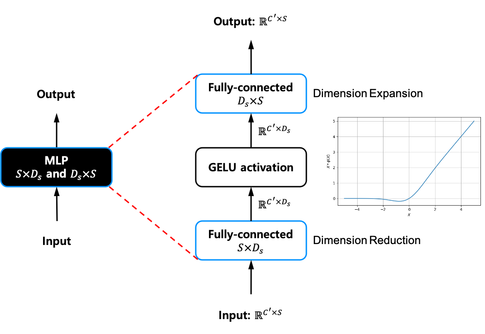
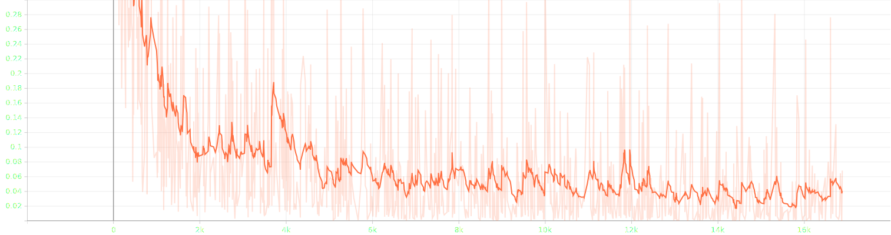

[TensorFlow 2] MLP-Mixer: An all-MLP Architecture for Vision
=====
TensorFlow implementation of "MLP-Mixer: An all-MLP Architecture for Vision"

## Concept
<div align="center">
    
  <p>The MLP-Mixer architecture [1].</p>
</div>

### Patch Embedding
<div align="center">
    
</div>

### Mixer Block
<div align="center">
    
</div>

### MLP in Mixer Blcok
<div align="center">
    
</div>

## Results

### Loss

  

### Performance

|Indicator|Value|
|:---|:---:|
|Accuracy|0.97860|
|Precision|0.97882|
|Recall|0.97808|
|F1-Score|0.97829|

```
Confusion Matrix
[[ 968    0    0    0    2    0    3    0    4    3]
 [   0 1127    0    1    1    0    2    1    3    0]
 [   3    0 1002    6    6    0    1    5    9    0]
 [   1    0    2  993    0    0    0    2   10    2]
 [   0    1    0    0  974    0    3    0    1    3]
 [   3    0    0   17    4  839    9    2   12    6]
 [   4    2    0    0   10    0  940    0    2    0]
 [   0    3    4    4    5    0    0 1005    3    4]
 [   0    0    3    1    5    0    1    3  956    5]
 [   1    3    0    3   14    1    0    4    1  982]]
Class-0 | Precision: 0.98776, Recall: 0.98776, F1-Score: 0.98776
Class-1 | Precision: 0.99208, Recall: 0.99295, F1-Score: 0.99251
Class-2 | Precision: 0.99110, Recall: 0.97093, F1-Score: 0.98091
Class-3 | Precision: 0.96878, Recall: 0.98317, F1-Score: 0.97592
Class-4 | Precision: 0.95397, Recall: 0.99185, F1-Score: 0.97254
Class-5 | Precision: 0.99881, Recall: 0.94058, F1-Score: 0.96882
Class-6 | Precision: 0.98019, Recall: 0.98121, F1-Score: 0.98070
Class-7 | Precision: 0.98337, Recall: 0.97763, F1-Score: 0.98049
Class-8 | Precision: 0.95504, Recall: 0.98152, F1-Score: 0.96810
Class-9 | Precision: 0.97711, Recall: 0.97324, F1-Score: 0.97517

Total | Accuracy: 0.97860, Precision: 0.97882, Recall: 0.97808, F1-Score: 0.97829
```

## Requirements
* Tensorflow 2.4.0  
* <a href="https://github.com/YeongHyeon/white-box-layer">whiteboxlayer</a> 0.2.8

## Reference
[1] Tolstikhin, Ilya O., et al. <a href="https://proceedings.neurips.cc/paper/2021/file/cba0a4ee5ccd02fda0fe3f9a3e7b89fe-Paper.pdf">"Mlp-mixer: An all-mlp architecture for vision."</a> Advances in Neural Information Processing Systems 34 (2021).
